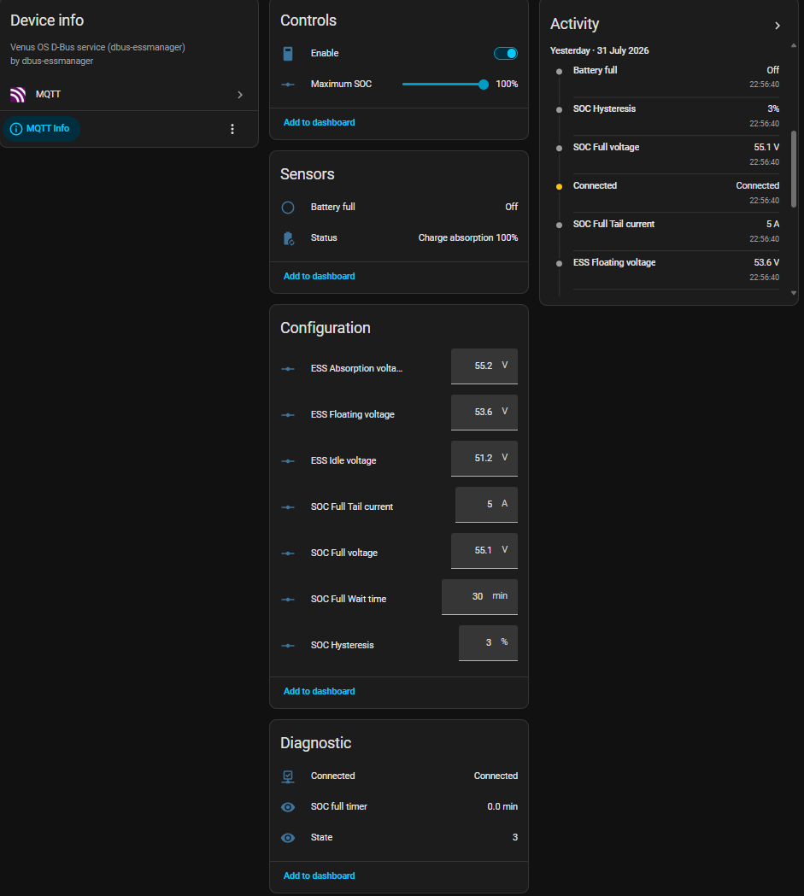
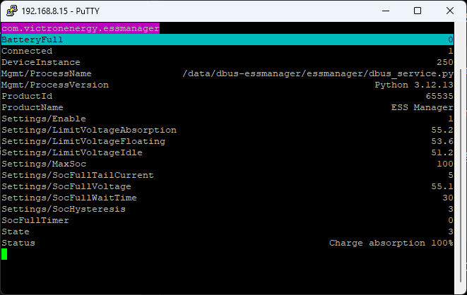

# dbus-essmanager

A lightweight D-Bus service for Venus OS that extends Victron ESS with
configurable battery charging strategies.

The service automatically controls the DVCC Maximum Charge Voltage based on
battery state, configurable charge limits and user-defined charging policies.

Designed for battery systems using Victron DVCC while remaining fully compatible with the standard Victron ecosystem.

## Screenshots

### Home Assistant



### D-Bus service



---

Warning

This software modifies the Victron DVCC Maximum Charge Voltage automatically.
It is intended for users who understand the implications of custom battery charging parameters.
Always verify your battery manufacturer's recommended charging limits.

## Features

- Native D-Bus service
- Persistent settings stored by `com.victronenergy.settings`
- Automatic DVCC Maximum Charge Voltage management
- Configurable maximum battery SOC
- Automatic transition between:
  - Charge absorption
  - Charge floating
  - Charge idle
- Configurable:
  - absorption voltage
  - floating voltage
  - idle voltage
  - full-battery detection voltage
  - tail current
  - validation time
  - SOC hysteresis
- MQTT support through the standard Venus MQTT broker
- Home Assistant MQTT Discovery
- No modifications required to Victron services
- Very low CPU and memory usage

---

## How it works

The service continuously monitors:

- Battery SOC
- Battery voltage
- Battery current

and automatically updates the DVCC Maximum Charge Voltage according to the
configured charging strategy.

When the battery reaches the configured full conditions:

- voltage above threshold
- current below tail current
- condition maintained for the configured time

the DVCC voltage is reduced to the configured Floating Voltage.

When the SOC later drops below the restart threshold, charging automatically
returns to Absorption Voltage.

If the user limits the maximum SOC below 100%, the service automatically
switches between:

Charge Absorption → Charge Idle

without performing full-battery detection.

---

## Architecture

```
                main.py
                    │
                    ▼
             EssManager
                    │
      ┌─────────────┼──────────────┐
      ▼             ▼              ▼
 DBusService   VictronSystem   VictronSettings
      ▲
      │
      ▼
 StateMachine
```

### Responsibilities

**EssManager**

Coordinates the complete control loop.

Reads:

- battery values
- configuration

Runs the state machine.

Publishes runtime values.

Updates the Victron DVCC settings.

---

**StateMachine**

Contains all charging logic.

Does **not** access D-Bus.

Pure decision engine.

---

**DBusService**

Exposes:

- persistent settings
- runtime values

Handles:

- validation
- persistence
- D-Bus communication

---

**VictronSystem**

Reads battery information from:

```
com.victronenergy.system
```

---

**VictronSettings**

Reads and writes:

```
Settings/SystemSetup/MaxChargeVoltage
Settings/SystemSetup/MaxChargeCurrent
```

---

## D-Bus interface

### Runtime paths

```
/BatteryFull
/SocFullTimer
/State
/Status
```

### Service settings

```
/Settings/Enable
/Settings/MaxSoc
/Settings/SocHysteresis
/Settings/SocFullVoltage
/Settings/SocFullTailCurrent
/Settings/SocFullWaitTime
/Settings/LimitVoltageIdle
/Settings/LimitVoltageFloating
/Settings/LimitVoltageAbsorption
```

### Persistent settings

```
/Settings/EssManager/Enable
/Settings/EssManager/MaxSoc
/Settings/EssManager/SocHysteresis
/Settings/EssManager/SocFullVoltage
/Settings/EssManager/SocFullTailCurrent
/Settings/EssManager/SocFullWaitTime
/Settings/EssManager/LimitVoltageIdle
/Settings/EssManager/LimitVoltageFloating
/Settings/EssManager/LimitVoltageAbsorption
```

---

## Installation

Clone the repository into:

```
/data/dbus-essmanager
```

Install:

```bash
chmod +x install.sh
./install.sh
```

The installer:

- installs the runit service
- enables automatic startup after reboot
- registers itself in `rc.local`

The service starts automatically.

---

## Updating

Simply replace the project files and run:

```bash
./install.sh
```

---

## Uninstall

Keep settings:

```bash
./uninstall.sh
```

Remove everything including persistent settings:

```bash
./uninstall.sh --purge
```

---

## Home Assistant

The service publishes Home Assistant MQTT Discovery information
automatically.

After installation the following entities are created automatically:

- Enable
- Maximum SOC
- Charge voltages
- Full battery detection settings
- Battery full
- State
- Status
- Connected
- Full timer

---

## MQTT

The service uses the standard Venus MQTT topics.

Configuration changes can be performed through:

```
W/<portal-id>/settings/0/Settings/EssManager/...
```

Example:

```json
{
  "value": 90
}
```

---


